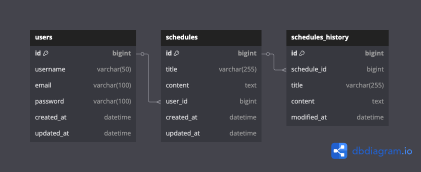

# [Spring 6기] CH 3 일정 관리 앱 Develop

---

## 1. 일정관리 API 명세서

| 기능     | Method | URL                  | request      | response     | 상태코드        |
|----------|--------|----------------------|---------------|--------------|------------------|
| 일정 등록 | POST   | `/api/schedules`     | 요청 body     | 등록 정보     | 200: 정상등록     |
| 일정 조회 | GET    | `/api/schedules/{id}` | 요청 param    | 단건 응답 정보 | 200: 정상조회     |
| 일정 목록 조회 | GET | `/api/schedules`   | 요청 param    | 다건 응답 정보 | 200: 정상조회     |
| 일정 수정 | PUT    | `/api/schedules/{id}` | 요청 body     | 수정 정보     | 200: 정상수정     |
| 일정 삭제 | DELETE | `/api/schedules/{id}` | 요청 param    | -            | 200: 정상삭제     |

> 💡 `요청 body` 는 JSON 형식으로 작성되며, `title`, `content`, `userId` 등을 포함함

---

## 2. ERD (Entity Relationship Diagram)

> 아래는 예상 ERD입니다.

---

## 3. 기술 스택
- Java 17
- Spring Boot
- Spring Data JPA
- H2/MySQL
- Cookie/Session 인증
- Gradle
